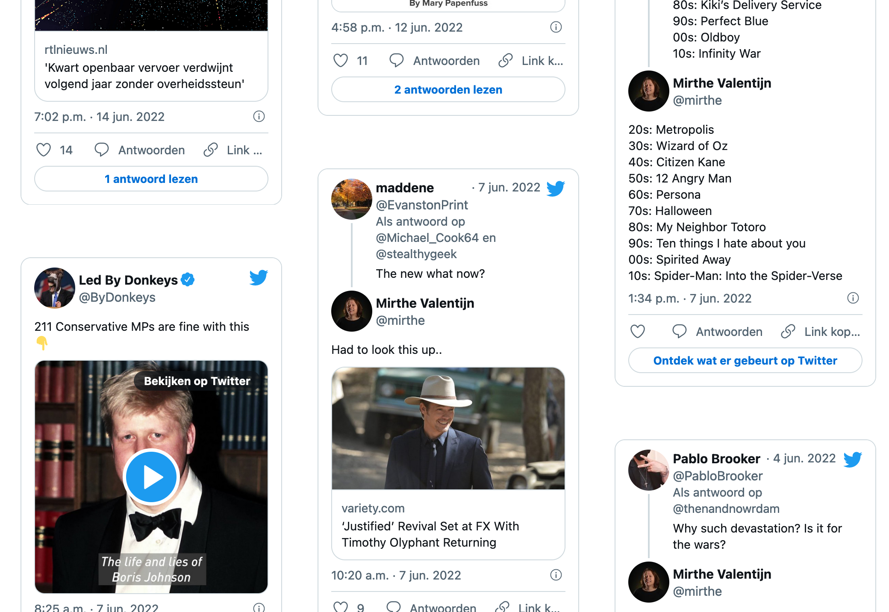

# Kirby Plugin: MyTwitter

This plugin allows you to show liked tweets for a Twitter account on your Kirby site

## Git submodule

```
git submodule add https://github.com/mirthe/kirby_mytwitter site/plugins/mytwitter
```

## Usage

Add your Twitters API key and username to your config

    'twitter.username'          => 'xx',
    'twitter.consumerkey'       => 'xx',
    'twitter.consumersecret'    => 'xx',
    'twitter.accesstoken'       => 'xx',
    'twitter.accesstokensecret' => 'xx'

Include one or more of the following snippets to display your tweets or likes on a page

    <?php snippet('twitter-likes'); ?>
    <?php snippet('twitter-posts'); ?>

## Example 

### Likes
<p></p>

### Posts
<p></p>

## Todo

- Offer as an official Kirby plugin
- Add sample SCSS to this readme
- Cleanup code
- Lots..
